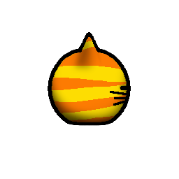
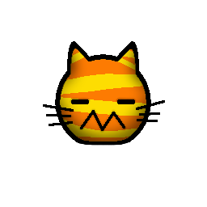
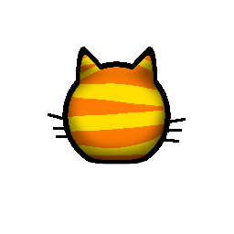

  

## A RimWorld cat mod that adds [tadmozeltov's](https://twitch.tv/tadmozeltov) "OC Tad"

# Custom Textures
<table width="100%">
  <tr>
    <th width="33%">
        
    </th>
    <th width="33%">
        
    </th>
    <th width="33%">
        
    </th>
  </tr>
  <tr>
    <th>Cat_east.png</th>
    <th>Cat_south.png</th>
    <th>Cat_north.png</th>
  </tr>
</table>

# Stats
OC Tad inherits a lot of its features from the vanilla cat. However some of its stats have been modified.
Below are tables showing the values modified in comparison to the vanilla cat, husky, panther, and warg. These are to help compare and balance the values.

### Attributes
|Attribute           |Cat  |Husky    |OC Tad   |Panther  |Warg         |
|--------------------|-----|---------|---------|---------|-------------|
|MoveSpeed           |4.4  |5        |5        |5        |5            |
|MarketValue         |100  |250      |349      |400      |450          |
|ComfyTemperatureMin |-25  |-50      |-37      |-8       |-40          |
|baseBodySize *      |0.32 |0.86     |0.73     |1        |1.4          |
|maxPreyBodySize     |0.25 |---      |0.29     |1        |2.3          |
|baseHungerRate      |0.15 |0.5      |0.31     |0.2      |0.4          |
|baseHealthScale     |0.42 |1.05     |1.27     |1.3      |1.4          |
|trainability        |None |Advanced |Advanced |Advanced |Intermediate |
|lifeExpectancy      |10   |12       |13       |13       |15           |
|combatPower **      |35   |75       |109      |120      |160          |

 *\* ``baseBodySize`` increased to enable ``Rescue`` and ``Haul`` training* 

 *\*\* ``combatPower`` determines how many points it costs to send in a manhunter event.* 

### Tools
|Tool       |Cat |Husky |OC Tad |Panther |Warg |
|-----------|----|------|-------|--------|-----|
|left claw  |6   |9.7   |11     |11      |13   |
|right claw |6   |9.7   |11     |11      |13   |
|bite       |7   |14.2  |13     |16      |15   |
|head       |3   |6     |5      |9       |5    |

### Summary
OC Tad is a versatile pet cat that is capable of advanced training unlike the vanilla cat. Combat wise, these stats make OC Tad stronger than a normal cat or husky but weaker than a panther or warg.

# Additional Features
When butchered, OC Tad drops its unique striped "Tadfur". This can *only* be crafted into an "OC Tad Mask" at a tailor bench. These items do not deteriorate.

<table width="100%">
  <tr>
    <th width="33%">
        
    </th>
    <th width="33%">
        
    </th>
    <th width="33%">
        
    </th>
  </tr>
  <tr>
    <th>Leather_a.png</th>
    <th>Leather_b.png</th>
    <th>Unfinished.png</th>
  </tr>
</table>

<table width="100%">
  <tr>
    <th width="33%">
        
    </th>
    <th width="33%">
        
    </th>
    <th width="33%">
        
    </th>
  </tr>
  <tr>
    <th>Mask_east.png</th>
    <th>Mask_south.png</th>
    <th>Mask_north.png</th>
  </tr>
</table>

### OC Tad Mask Stats
|Requirements         |Value                                      |
|---------------------|-------------------------------------------|
|researchPrerequisite |Complex Clothing                           |
|recipeUsers          |HandTailoringBench, ElectricTailoringBench |
|skillRequirements    |Crafting 7                                 |
|WorkToMake           |6001                                       |

|Crafting Ingredients   |Amount |
|-----------------------|-------|
|Leather_OCTad (tadfur) |1      |

|Attribute         |Value |
|------------------|------|
|MaxHitPoints      |101   |
|Mass              |1     |
|ArmorRating_Sharp |0.23  |
|ArmorRating_Blunt |0.05  |
|ArmorRating_Heat  |0.23  |
|Insulation_Cold   |9.7   |
|Insulation_Heat   |1.7   |
|SocialImpact      |0.19  |
|SlaveSuppression  |-0.07 |

# Legal
Portions of the materials used to create this content/mod are trademarks and/or copyrighted works of Ludeon Studios Inc. All rights reserved by Ludeon. This content/mod is not official and is not endorsed by Ludeon.

Source is licensed under [GPLv3](https://www.gnu.org/licenses/gpl-3.0.en.html#license-text).

Art content (derivative works and original works) © 2024 by Lahkro is licensed under [CC BY-NC-SA 4.0][cc-by-nc-sa].
Contains derivative work of "OC Tad" art by tadmozeltov.

[![CC BY-NC-SA 4.0][cc-by-nc-sa-image]][cc-by-nc-sa]

[cc-by-nc-sa]: http://creativecommons.org/licenses/by-nc-sa/4.0/
[cc-by-nc-sa-image]: https://licensebuttons.net/l/by-nc-sa/4.0/88x31.png